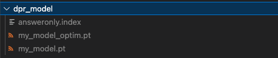

# 코메이크 정관 상용화 README

## How To Run

- 아래 드라이브 링크에서 로컬 모델을 다운 받아 현재 디렉토리에 넣어줍니다.

```python
https://drive.google.com/drive/folders/1M1c2d7KxggVau5BCpywNSQ9FTt3eeeJb?usp=sharing
```




- 가상 환경을 설치한 뒤 필요한 패키지를 깔아줍니다.
    
    ```python
    pip install -r requirements.txt
    ```
    

- OpenAI key를 입력합니다.
    - resources/openai_key.json에 OpenAI key를 입력합니다.
    
    ```python
    {
        "key": "$YOUR_API_KEY"
    }
    ```
    

- [main.py] 코드를 실행합니다.
    
    ```python
    python main.py --input_file_path input_samples/jeongguan_1.txt \
    --gpt_ver gpt-4-1106-preview --openai_key_file_path resources/openai_key.json \
    --top_k_jeongguan 3 --top_k_sangbub 3
    ```