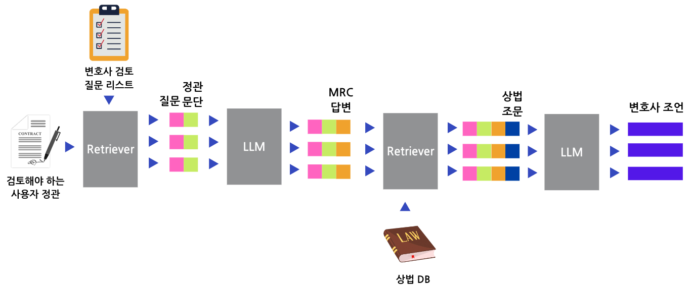
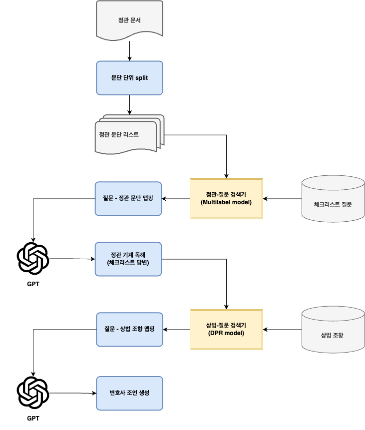
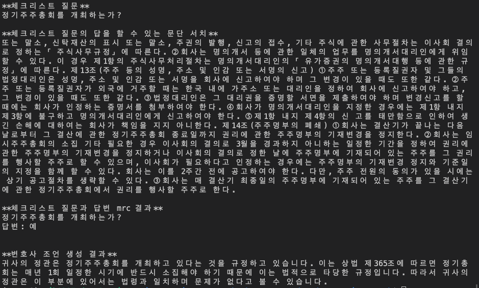

# 코메이크 정관 상용화 README

## 1. Architecture 구성



- 1단계 정관 문서 기계 독해, 2단계 변호사 조언 생성 단계로 구성된 파이프라인
- 각 단계를 Retrieval-augmented Generation (RAG)으로 구성하고, 각 모듈을 두 번 반복하여 LLM의 hallucination을 감소

## 2-1. 시스템 Flow Chart



- (1) 사용자가 정관 문서를 업로드한다.
- (2) 시스템은 정관 문서를 문단으로 split한다.
- (3) 시스템은 체크리스트 질문과 가장 관련있는 문단을 검색하여 맵핑한다. (로컬의 multi-label classification model 활용)
- (4) 시스템은 정관 문단과 체크리스트 질문을 읽고 기계 독해 (Mahchine Reading Comprehension)하여 답변을 작성한다. (OpenAI API 활용, gpt-4)
- (5)시스템은 체크리스트 질문과 관련 있는 상법 조항을 검색한다. (로컬의 DPR model 활용)
- (6) 시스템은 체크리스트 질문-답변 결과, 관련된 상법 조항을 바탕으로 변호사 조언을 생성한다.  (OpenAI API 활용, gpt-4)

## 2-2. 실행 예시



## 3. 주요 기능 코드 동작

→ Flow Chart의 파란색 박스가 주요 기능입니다.

→ `main.py`에서 확인하시면 됩니다.

### 1) 문단 단위 split

- 정관 문서가 들어오면 문단 단위로 나누어 리스트로 저장합니다. 장 단위로 문단을 나눈 뒤, 길이가 긴 장은 1200 길이 이하가 되도록 분리합니다.
- `split_document_shorter` 함수 호출
    - input
        - **input_text** : 정관 문서 텍스트 (str)
    - output
        - **clean_para** : 일정 길이로 나누어진 정관 문단 리스트 (list)
        

### 2) 질문 - 정관 맵핑

- 학습된 로컬의 질문-정관 맵핑 multilabel classification 모델로 semantic search를 통해 체크리스트 질문과 가장 가까운 문단을 매칭합니다.
- `get_paragraph` 함수 호출
    - input
        - **question** : 체크리스트 질문 (str)
        - **input_texts** : 정관 문단들 (list)
        - **top_k** :  문단 서치할 top-k (int)
    - output
        - **paragraphs** : 체크리스트와 관련된 top-k의 정관 문단들 (list)
        

### 3) 정관 기계 독해 (체크리스트 답변)

- 매칭된 하나의 체크리스트 질문과 정관 문단을 GPT에 던져서 체크리스트 답변을 얻습니다.
- `get_mrc_answer` 함수 호출 후 `generate_answer` 호출
    - input
        - **gpt_ver** : OpenAI GPT 모델 버전 (str)
        - **input_text**  : 정관 문단 (str)
        - **question** : 체크리스트 질문 (str)
    - output :
        - **result**  : 체크리스트 질문에 대한 답변 (str)
    

### 4) 질문 - 상법 조항 맵핑

- 체크리스트 질문과 가장 관련있는 상법 조항 학습된 로컬의 DPR model inference를 통해 을 매칭합니다.
- `get_advice` 호출 후 `retrieval_reference` 호출
    - input
        - **top_k** : 관련 있는 상법 조항을 몇 개까지 찾아서 맵핑할 것인지 (int)
        - **question** : 체크리스트 질문 (str)
    - output :
        - query: 체크리스트 질문 (str)
        - references: top-k개의 관련 있는 상법 조항 (str)
        

### 5) 변호사 조언 생성

- 체크리스트 질문, 답변, 관련 상법 조항이 프롬프트를 GPT에 던져 최종 변호사 조언을 생성합니다.
- `get_advice` 호출 후 `generate_advice` 호출
    - input
        - **gpt_ver** : OpenAI GPT 모델 버전 (str)
        - **prompt** : 체크리스트 질문, 답변, 관련 상법 조항이 포함된 프롬프트 템플릿 (str)
    - output
        - **answer** : 생성된 변호사 조언 (str)

## 4. 의사 결정이 필요한 지점

- UI/UX 논의 : 이전 코메이크에서 개발했던 정관 검토 시스템과 동일한지, 혹은 chat형식일지
    - 추가적인 기능이 필요한 경우 기능 추가
- “문단 → 체크리스트 서치”와 “체크리스트 → 문단 서치” 중 어떤 기능으로 구현하는 것이 좋을지
    - 현재 두 가지 모두 구현 되어 있음, documnetaion은 “체크리스트 → 문단 서치”로 작성됨
    - 정확도 / 응답 시간 / 활용성 측면에서 확인 필요
    
    ### 1) 문단 → 체크리스트 서치
    
    - 1) 사용자가 정관 문서를 업로드한다.
    - 2) 시스템은 정관 문서를 문단으로 split한다. (장 단위)
    - 3) 시스템은 각 문단 별로 관련있는 체크리스트 질문을 뽑아 질문과 정관 문단을 맵핑한다. (multi-label classification model 활용)
    - 4) 시스템은 정관 문단과 체크리스트 질문을 읽고 기계 독해 (Mahchine Reading Comprehension)하여 답변을 작성한다. (OpenAI API 활용, gpt-4)
    - 5) 시스템은 체크리스트 질문과 관련 있는 상법 조항을 검색한다. (DPR model 활용)
    - 6) 시스템은 체크리스트 질문-답변 결과, 관련된 상법 조항을 바탕으로 변호사 조언을 생성한다.
    
    - 실행 예시
        
        
        
    
    - 해당 방법의 장점
        - 문단별로 체크리스트를 뽑게끔 학습이 이루어졌기 때문에 정확도가 더 높음
        
    - 문제가 되는 상황
        
        
        
        - 첫 번째 문단에서는 ‘임시 주주총회를 개최하는가?’에 대한 답을 얻을 수 없으므로 정관 수정이 필요하다고 조언. 그러나 4번째 문단에서 임시 주주총회 개최에 대한 내용이 포함되어 있기 때문에 해당 조언은 틀린 조언임.
        - 하나의 질문에 대하여 문단별로 여러번 호출해서 답변하므로 각 문단별 질문에 대한 답변의 일관성이 보장되지 않음. 따라서후처리하여 통합할 수 있게 하는 것이 필요함.
        - 문단별 뽑히는 질문의 개수가 많기 때문에 GPT 호출 횟수가 여러번 늘어나는 단점
        - threshold 조정으로 개선 가능
        
    
    ### 2) 체크리스트 → 문단 서치


## How To Run

- 아래 드라이브 링크에서 로컬 모델을 다운 받아 현재 디렉토리에 넣어줍니다.

```python
https://drive.google.com/drive/folders/1M1c2d7KxggVau5BCpywNSQ9FTt3eeeJb?usp=sharing
```


- 가상 환경을 설치한 뒤 필요한 패키지를 깔아줍니다.
    
    ```python
    pip install -r requirements.txt
    ```
    

- OpenAI key를 입력합니다.
    - resources/openai_key.json에 OpenAI key를 입력합니다.
    
    ```python
    {
        "key": "$YOUR_API_KEY"
    }
    ```
    

- [main.py] 코드를 실행합니다.
    
    ```python
    python main.py --input_file_path input_samples/jeongguan_1.txt \
    --gpt_ver gpt-4-1106-preview --openai_key_file_path resources/openai_key.json \
    --top_k_jeongguan 3 --top_k_sangbub 3
    ```
