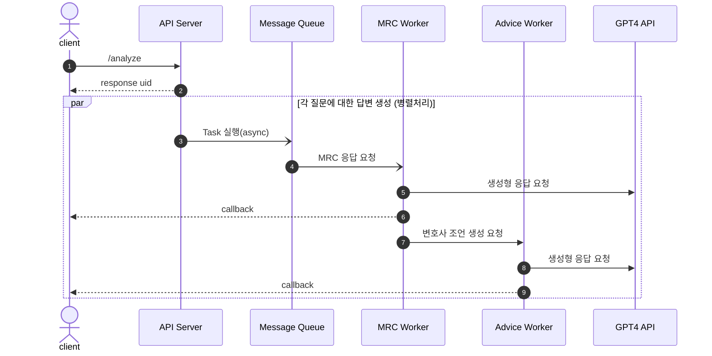

# XAI Law API 정의서

API의 동작은 아래 URL에서 확인하실 수 있습니다.

- 서버 URL: https://sogang.lifefeel.net/xai_law/


API의 동작의 순서는 아래와 같습니다.




## API 목록

### 정관 분석 요청

- **URL**: `/analyze`
- **Method**: `POST`
- **Path Parameters**:
  - `file`: 정관 파일(.txt 파일을 multipart/form-data로 전송)
  - `callback_url`: callback을 받고자 하는 URL 주소
- **Response**:
  - **Type**: `Content-Type: application/json`
  - **data**:
    - `checklist_questions`: 56개의 qustions을 순서대로 응답
    - `doc_paragraphs`: 분할된 문단 리스트
    - `mapping_paragraphs`: 각 질문과 매핑된 문단 인덱스
    - `document`: parser에 의해 각 장별로 분리된 내용
      - 형식 예:
        ```json
        [
        	{
            "title": "제 1장 총 칙",
            "content": "제 1조(상호)..."
        	},
        	{
            "title": "제 2장 주식과 주권",
            "content": "제 5조(주식의 총수)..."
        	}
        ]
        ```
    - `uid`: 생성된 고유값

### 특정 질문 분석 요청

`/analyze`를 이용한 정관 분석 후 일부 네트워크 상황 등으로 인해 callback을 받지 못한 경우 추가로 분석 처리를 위한 API 입니다. 동작 방식은 `/analyze`와 동일하며 요청 시 넘겨야 하는 값이 일부 추가되었습니다.

- **URL**: `/analyze`
- **Method**: `POST`
- **Path Parameters**:  
  - `file`: 정관 파일(.txt 파일을 multipart/form-data로 전송)
  - `callback_url`: callback을 받고자 하는 URL 주소
  - `uid`: 이전 요청에서 받은 uid를 넘김
  - `q_ids`: 콤마로 구분 된 질문의 인덱스(예: 3,4)
- **Response**: 
  - **Type**: `Content-Type: application/json`
  - **data**:
    - `checklist_questions`: 요청받은 qustions을 순서대로 응답
    - `uid`: request 시 넘어온 uid를 그대로 반환

## Callback 정의

callback은 `/analyze` 요청 시 `callback_url` 변수에 설정한 URL로 응답을 합니다. 응답의 형식은 아래와 같습니다.

- **Method**: `POST`
- **Path Parameters**:
  - `uid`: `/analyze` 요청의 응답으로 받은 고유값
  - `idx`: question의 인덱스 번호
  - `answer`: MRC 답변 결과
  - `advice`: 변호사 조언 답변 결과


callback은 각 질문마다 두 차례로 나뉘어서 응답이 됩니다. 

- 첫 번째 응답: `uid`, `idx`, `answer` 를 응답
- 첫 번째 응답: `uid`, `idx`, `advice` 를 응답

