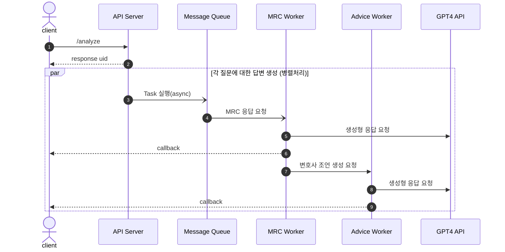

# XAI Law API 정의서

API의 동작은 아래 URL에서 확인하실 수 있습니다.

- 서버 URL: https://sogang.lifefeel.net/xai_law/


API의 동작의 순서는 아래와 같습니다.




## API 목록

### 정관 분석 요청

- **URL**: `/analyze`

- **Method**: `POST`

- **Path Parameters**:
  
  - `file`: 정관 파일 (.txt 파일을 multipart/form-data로 전송)
  - `callback_url`: callback을 받고자 하는 URL 주소
  - `gpt_model`: OpenAI에서 제공하는 모델의 이름 (사용 가능한 모델은 [OpenAI Models](https://platform.openai.com/docs/models/models)에서 확인 가능)
    - `gpt-3.5-turbo` (기본값)
    - `gpt-4-turbo`
    - `gpt-4-turbo-preview`
  
- **Response**:
  
  - **Type**: `Content-Type: application/json`
  
  - **data**:
    - `checklist_questions`:  qustions 목록
    
      - 형식 예:
    
        ```json
        [
          {
            "question": "정기주주총회를 개최하는가?",
            "type": 1
          },
              {
            "question": "정기주주총회는 언제 소집하나?",
            "type": 2
          }
        ]
        ```
    
    - `doc_paragraphs`: 분할된 문단 리스트
    
    - `mapping_paragraphs`: 각 질문과 매핑된 문단 인덱스
    
    - `document`: parser에 의해 각 장별로 분리된 내용
      - 형식 예:
        ```json
        [
        	{
            "title": "제 1장 총 칙",
            "content": "제 1조(상호)..."
        	},
        	{
            "title": "제 2장 주식과 주권",
            "content": "제 5조(주식의 총수)..."
        	}
        ]
        ```
    
    - `uid`: 생성된 고유값

#### 상태 코드

| 코드번호 | 이름                       | 의미                                       |
| -------- | -------------------------- | ------------------------------------------ |
| 160      | INVALID_DOCUMENT           | document의 형식이 부적절한 경우            |
| 200      | SUCCESS                    | 성공                                       |
| 500      | NO_FILE_PART               | 파일 업로드 시 file 관련 필드가 없는 경우  |
| 501      | NO_SELECTED_FILE           | 파일 업로드 시 선택한 파일이 없는 경우     |
| 502      | NOT_ALLOWED_FILE_EXTENSION | 파일 업로드 시 지원되지 않는 확장자인 경우 |

### 특정 질문 분석 요청

`/analyze`를 이용한 정관 분석 후 일부 네트워크 상황 등으로 인해 callback을 받지 못한 경우 추가로 분석 처리를 위한 API 입니다. 동작 방식은 `/analyze`와 동일하며 요청 시 넘겨야 하는 값이 일부 추가되었습니다.

- **URL**: `/analyze`
- **Method**: `POST`
- **Path Parameters**:  
  - `file`: 정관 파일(.txt 파일을 multipart/form-data로 전송)
  - `callback_url`: callback을 받고자 하는 URL 주소
  - `uid`: 이전 요청에서 받은 uid를 넘김
  - `q_ids`: 콤마로 구분 된 질문의 인덱스(예: 3,4)
- **Response**: 
  - **Type**: `Content-Type: application/json`
  - **data**:
    - `checklist_questions`: 요청받은 qustions을 순서대로 응답
    - `uid`: request 시 넘어온 uid를 그대로 반환


## Callback 정의

callback은 `/analyze` 요청 시 `callback_url` 변수에 설정한 URL로 응답을 합니다. 응답의 형식은 아래와 같습니다.

- **Method**: `POST`
- **Path Parameters**:
  - **공통**
    - `uid`: `/analyze` 요청의 응답으로 받은 고유값
    - `idx`: question의 인덱스 번호
  - **answer callback**
    - `answer`: MRC 답변 결과
    - `title`: 답변이 포함된 조항의 이름
    - `sentence`: 답변 결과가 포함된 문장
    - `doc_idx_i`: 장의 인텍스 (장을 못찾을 경우 -1 리턴, 참고: `document[i][j]`)
    - `doc_idx_j`: 조의 인덱스 (조를 못찾을 경우 -1 리턴, 참고: `document[i][j]`)
  - **advice callback**
    - `advice`: 변호사 조언 답변 결과
    - `is_satisfied`: 만족 여부에 대한 응답(0: 불만족, 1:확인필요, 2:만족)
  


callback은 각 질문마다 두 차례로 나뉘어서 응답이 됩니다. 

- 첫 번째 응답(answer callback): `uid`, `idx`와 answer callback의 값을 리턴
- 첫 번째 응답(advice callback): `uid`, `idx`와 advice callback의 값을 리턴

### Callback 테스트

위에 정의된 형식으로 callback이 잘 되는지를 테스트하기 위해서는 아래 주소로 요청을 하시면 됩니다. 테스트는 사전에 정해놓은 질문 1개에 대해 OpenAI API의 질의 후 결과를 callback 하도록 구현되어 있습니다. 매 요청시마다 answer callback과 advice callback이 각각 요청이 됩니다.

- **URL**: `/callback_test`
- **Method**: `POST`
- **Path Parameters**:  
  - `callback_url`: callback을 받고자 하는 URL 주소
  - `uid`: 없을 경우 자동 생성됨
- **Response**: 
  - **Type**: `Content-Type: application/json`
  - 성공 시 `SUCCESS(200)` 코드를 리턴


## 공통 상태 코드

| 코드번호 | 이름                       | 의미                                               |
| -------- | -------------------------- | -------------------------------------------------- |
| 100      | UNKNOWN_ERROR              | 에러의 종류를 특정하기 어려울 때 출력              |
| 101      | NO_SERVER_RESPONSE         | 내부 추론서버가 응답을 하지 않을 경우              |
| 102      | INVALID_PARAMETER          | GET/POST에서 값을 넘기지 않거나 적절하지 않은 경우 |
| 160      | INVALID_DOCUMENT           | document의 형식이 부적절한 경우                    |
| 200      | SUCCESS                    | 성공                                               |
| 300      | TIMEOUT                    | 타임아웃                                           |
| 500      | NO_FILE_PART               | 파일 업로드 시 file 관련 필드가 없는 경우          |
| 501      | NO_SELECTED_FILE           | 파일 업로드 시 선택한 파일이 없는 경우             |
| 502      | NOT_ALLOWED_FILE_EXTENSION | 파일 업로드 시 지원되지 않는 확장자인 경우         |
