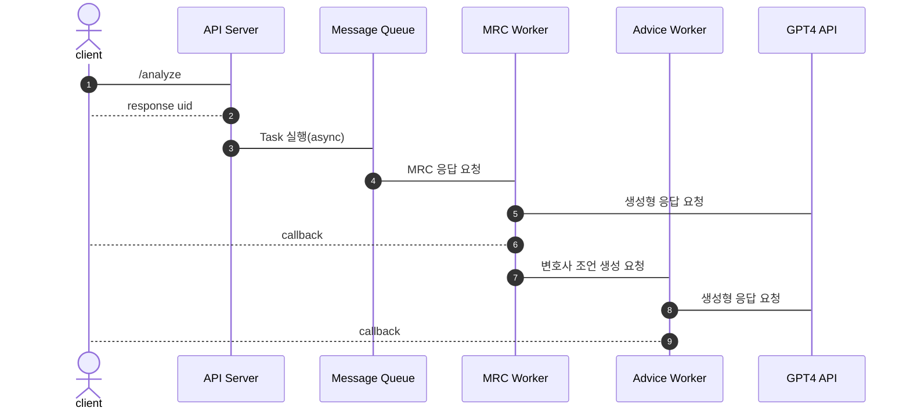

# XAI Law API 정의서

API의 동작은 아래 URL에서 확인하실 수 있습니다.

- 서버 URL: https://sogang.lifefeel.net/xai_law/

API의 동작의 순서는 아래와 같습니다.

## API 목록

### 정관 분석 요청

- **URL**: `/analyze`
- **Method**: `POST`
- **Path Parameters**:  
  - - `file`: 정관 파일(텍스트 형태의 데이터)
    - `callback_url`: callback을 받고자 하는 URL 주소
- **Response**: 
  - **Type**: `Content-Type: application/json`

  - **data**:
    - `checklist_questions`: 56개의 qustions을 순서대로 응답
    - `doc_paragraphs`: 분할된 문단 리스트
    - `mapping_paragraphs`: 각 질문과 매핑된 문단 인덱스
    - `uid`: 생성된 고유값

## Callback 정의

callback은 `/analyze` 요청 시 `callback_url` 변수에 설정한 URL로 응답을 합니다. 응답의 형식은 아래와 같습니다.

- **Method**: `POST`
- **Path Parameters**:
  - `uid`: `/analyze` 요청의 응답으로 받은 고유값
  - `idx`: question의 인덱스 번호
  - `answer`: MRC 답변 결과
  - `advice`: 변호사 조언 답변 결과

callback은 각 질문마다 두 차례로 나뉘어서 응답이 됩니다. 

- 첫 번째 응답: `uid`, `idx`, `answer` 를 응답
- 첫 번째 응답: `uid`, `idx`, `advice` 를 응답

